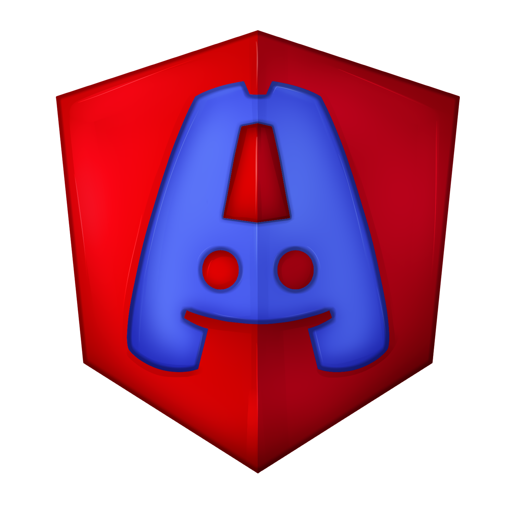

# NgDiscordClient



## About
ng-discord is a simplified Discord remake made with the Angular framework. Anyone is free to use ng-discord for any purposes they intend to. Just follow the license rules :)

## Getting started (Docker)

Requires [Docker Desktop](https://www.docker.com/products/docker-desktop/) (or Docker Engine + Compose).

```bash
cp .env.example .env
docker compose up --build
```

Then open http://localhost:4200 and **register a new account**. There is no seed user or dummy servers — create a server from the `+` button after logging in.

| Service    | URL |
|-----------|-----|
| Frontend  | http://localhost:4200 |
| API       | http://localhost:80 |
| WebSocket | ws://localhost:8080 |
| MySQL     | localhost:3306 |

Default DB credentials are in `.env.example` (`ng_discord` / `ng_discord`). Schema loads automatically on first start (empty database).

Useful commands:

```bash
docker compose up --build      # start everything
docker compose down            # stop containers
docker compose down -v         # stop and wipe the database volume
docker compose logs -f api     # follow API logs
```

If host port 80 is already in use, set `API_PORT=8081` in `.env` and update `apiUrl` in `src/environments/environment.ts` to match.

## Endpoints

### Auth

#### Register
`/backend/auth/register`

#### Login
`/backend/auth/login`

### Messages

#### deleteMessageById
`/backend/messages/deleteMessageById`

#### getMessageById
`/backend/messages/getMessageById`

#### getMessages
`/backend/messages/getMessages`

#### postMessage
`/backend/messages/postMessage`

## Servers

### createServer
`/backend/servers/createServer`

### deleteServer
`/backend/servers/deleteServer`

### joinServer
`/backend/servers/joinServer`

### leaveServer
`/backend/servers/leaveServer`
